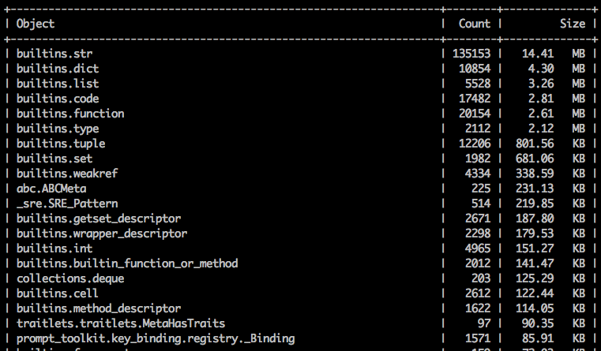
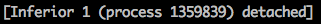
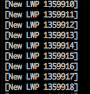
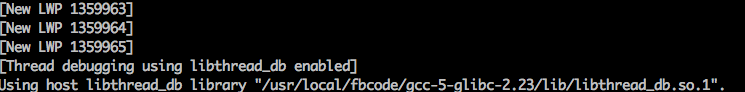
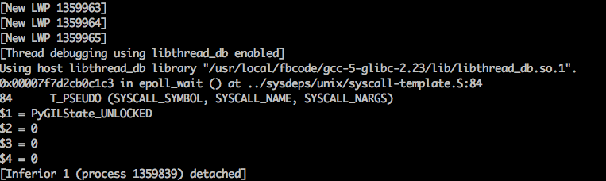
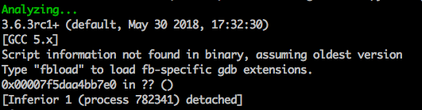

# Python3 Memory Analyzer For Running Processes

Chasing down a memory leak? Don't want to add debugging code, or even stop your process?

You've come to the right place.

# memory_analyzer

Running the memory analyzer does not require you to stop your process or add any
special debugging code or flags. Running the analysis will not (*cough* should not) break
your process, although your process (and all of its threads!) will be paused while
the memory analyzer gathers information about the objects in memory.

You will need to install objgraph and pympler in the target binary's library
path, in addition to the deps in `requirements*.txt` for running the frontend.

## License

This source code is licensed under the MIT license. Please see the LICENSE in the root directory for more information. 

## Things you can find out:


1. How many of each object you have in memory

2. The total size of all of these objects

3. The forward references to the objects

4. The backwards references to the objects

5. The difference in size/number of objects over time (through snapshot comparisons)

### Example Output:



## How To Run

1. Find the PID of your process:


       ps aux | grep <your process>


2. Run the memory analyzer against it:

       memory_analyzer run $PID

This will put you into an ncurses UI and make a binary output file located in `memory_analyzer_out/memory_analyzer_snapshot-{TIMESTAMP}`

If you are analyzing a process that was run as root, you need to run the analyzer as root as well.

### Running on a modern ptrace-limited system

Modern versions of at least Ubuntu and Arch have a patch that disallows ptracing
of non-child processes by non-root users.

You can disable this using

```
echo 0 | sudo tee /proc/sys/kernel/yama/ptrace_scope
```

or run `memory_analyzer` as root.


## View the Output without Re-Analyzing

If you exit out of the UI but want to view the snapshot data again without re-running the analysis, you can use the 'view' command.


    memory_analyzer view <snapshot output file>


## Analyze Multiple Processes

You can analyze multiple processes at once by simply providing a list of the PIDs separated by spaces.

    memory_analyzer run 1234 4567 890

If `--snapshot` is used, it tries to pair up the listed PIDs with the PIDs in the snapshot file. If they do pair, a new page is created for each like PID comparing the old and the new version. If it can't find any PIDs that pair up it just compares the first new and first old object.

If the references flags are used the references are found for all of the PIDs listed.

## Viewing Forwards and Backwards References

You can either view the top N number of objects (sorted by size of object), or you
can look for specific objects. The memory analyzer will generate PNG files displaying the graph, and will upload them for you to phabricator for easy viewing. If you don't want them uploaded you can use the `—no-upload` flag.


WARNING: Getting the references is a costly operation! The more references you grab
the longer your process will remain paused for.

### View the Top 2 Objects

    memory_analyzer run -s 2 $PID

### View specific objects

To view a specific object you must know it's fully qualified domain name. If you are unsure, I'd recommend running the analyzer first with no flags and identifying the names of the objects you are most interested in there.

    memory_analyzer run $PID -ss __main__.Foo -ss builtins.str

This will get the forwards and backwards references of the Foo and str objects.

## Comparing Snapshots

Comparing snapshots can be useful to show you how objects grow over time. To create an initial snapshot, just run the analyzer normally:

    memory_analyzer run $PID --snapshot <previous snapshot file>

By default your snapshot files will all be saved in memory_analyzer_out/. 
The snapshot analysis will be located on the second page of the ncurses UI, so hit the arrow key to the right to scroll to the snapshot page once you are in the UI.


## Specify the executable

The memory analyzer launches GDB with the executable found in `sys.executable`. This might not be the executable you want to use to analyze your binary. For example, you may need to use the debuginfo binary. You can specify the executable with the `-e` flag:

    memory_analyzer run $PID -e /usr/local/bin/python3.7-debuginfo

## Custom output file

If you don't want the file to be the default name, pass in your own custom name.


     memory_analyzer run $PID -f test_output1


## Navigating the UI

Navigating the UI should be relatively intuitive. You can use the arrow keys or wasd to scroll up and down.

   Scroll Up: Up arrow key or 'w'
   
   Scroll Down: Down arrow key or 's'
    
   Switch to next page: Right arrow key or 'd'
   
   Switch to previous page: Left arrow key or 'a'
   
   Page Up: Page Up key
    
   Page Down: Page Down Key
    
   Jump to Bottom of page: G
    
   Jump to Top of page: H
    
   Exit: 'q'
    
  

## Dealing with Multithreading

Right now the program does NOT run in non-stop mode, meaning that if you have multiple threads they will all be paused during analysis. This could be a problem for some services that require threads to be completing live in the background. It might be possible to support non-stop mode (where only one thread gets paused), but it will only work if the process is stopped and started again by the memory analyzer (this is a limitation of GDB). Please contact me (lisroach) if you are interested in this feature. 

Importantly, this means debugging multithreaded processes goes **much** slower than single threaded- because it takes the time to find and pause each individual thread. If your process has timeouts that could be triggered by a paused thread (e.g. something that talks over the network), use the memory_analyzer with caution.


## FAQ

### No data returned

Try running the process with the `--debug` flag enabled for more information. If there are no obvious errors occurring, your program is likely hung and cannot be analyzed.


### No symbol table is loaded.  Use the "file" command.

This is an error from GDB itself, and it could mean a couple of things:
1. You don't have the correct debuginfo installed, or
2. You are using the wrong Python executable. 

To fix the incorrect debuginfo install the debuginfo associated with the python runtime the analyzed process is using. For example:
    
    sudo yum install python3-debuginfo

or
    sudo apt-get install python3-dbg


To solve the wrong Python executable, figure out what executable you need (which python version the analyzed process is running with), and use the --exec flag to specify it:

    memory_analyzer run $PID -e /usr/local/bin/python3.6


### It is hanging

Try running the memory_analyzer with the `--debug` flag. This is going to show you what GDB is currently doing.

You should not see:

`$5 = <some number>`

or 



These are problems. Please file a bug. The memory_analyzer is a new tool, so not all scenarios have been tested and you may have run into something new. Keep reading for more information on understanding the debug output.


If you see:



That means your process has a lot of threads, and it's probably taking GDB a long time to pause them all.

After this you will see:



That means GDB is still working on doing GDB things, loading symbols and what not. This is usually what takes the longest, and as of right now I am not sure how to fix it. If you were to run `gdb` directly and attach to your process, this would take just as long :(

It is not until you see:



That the analyzer itself is running. Generally this runs very fast and you should barely see these messages flicker by. 


If you don't see the above, but you do see:



This usually means you are not analyzing the correct process. Perhaps your process is not Python (maybe you analyzed while buck is building)?


### Does it run on Windows

No. If you are interested in having this available on Windows it should be possible to add this, let `lisroach` know.

### Does it work with Python 2

No, unfortunately this is Python 3 exclusive and is likely to stay that way.


# Development

Any help is welcome and appreciated!
